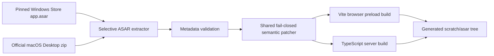

# Architecture

`codex-web` reuses the official Codex Desktop renderer while replacing the
Electron window boundary with a browser/server bridge. Official application
code is extracted at install time and is not stored in this repository.

## Build-time flow

Windows selects the exact installed `OpenAI.Codex` Appx package recorded in
`scripts/runtime-versions.json`; newer local Store packages are used only by an
explicit override. macOS and Linux download the pinned official macOS zip, or
consume `HOSTED_CODEX_APP_ZIP` when supplied. Both paths converge on:

- `scripts/windows/setup.ps1` and `scripts/unix/*.sh`, the platform-specific
  source acquisition adapters behind the shared `npm run build` entry;
- `scripts/extract-needed-asar.mjs`, which extracts only the Desktop package
  metadata, compiled shell bundles, webview, skills, and native-menu locales;
- `scripts/patch-desktop-asar.mjs`, which validates the ChatGPT brand and applies
  every browser compatibility change through unique semantic anchors;
- `scripts/generate-pwa-icon.mjs`, which creates the browser install icon; and
- the shared browser and server builds.

Selective extraction intentionally omits upstream native modules. The Desktop
shell only leaves `better-sqlite3` external in the supported bundle, and the
project supplies a host-native build of that dependency.

## Runtime flow

The official renderer expects a preload script and Electron IPC. Vite bundles
the upstream preload together with `src/browser/shim.ts`, which provides the
small Electron-compatible surface needed in a normal browser.

Renderer IPC is serialized over a WebSocket to `src/server/main.ts`. The server
loads the official Desktop main bundle after installing the module alias in
`src/server/module.ts`; imports of `electron` resolve to the host-side shim in
`src/server/electron/`. The existing MessagePort/app-host forwarding is kept so
subagents and newer Desktop protocol paths continue to work.

The browser shim handles local browser concerns such as history mapping, mobile
sidebar state, touch interaction fallbacks, file/workspace selection, and local
file URLs. On narrow viewports, `src/browser/mobile-layout.ts` turns the Desktop
left and right sidebars into overlay drawers, removes the desktop application
menu, and owns outside-tap dismissal. `src/browser/touch-interactions.ts`
preserves the renderer's Pointer Events and dedicated file-tree gestures while
exposing hover-only actions on coarse pointers, mapping handled long presses to
context-menu events, and bridging native HTML drag sources that lack a touch
path. The server shim owns privileged host behavior such as filesystem access
and launching the Codex app-server. Platform-specific Appx/zip discovery never
enters this runtime IPC layer.

On every ordinary host, `scripts/managed-runtime.mjs` chooses the pinned Codex
CLI artifact by OS and architecture, validates its npm SRI SHA-512 value, and
extracts it below `scratch/runtime/`. `scripts/run-server.mjs` is both the npm
binary and server entry point; it prepares the runtime when missing and then
sets `CODEX_CLI_PATH` for the compiled server. It also owns the shared host,
port, and optional Tailscale discovery arguments on every platform. The Windows
build adapter uses the same runtime manager. Explicit `CODEX_CLI_PATH` values
remain overrides. No `CODEX_HOME` override is applied, so the managed executable
shares the host's normal account, configuration, and data directories.

Nix reads the same manifest artifacts but preserves reproducibility by fetching
the CLI into the Nix store and wrapping `codex-web` with that store path. Runtime
download caches and extracted binaries are never included in npm packages.

## Version contracts

These values must not be conflated:

- macOS Sparkle release version;
- Windows Appx package version;
- `version` inside the extracted ASAR;
- Electron version inside the ASAR package metadata; and
- Codex CLI version.

The ASAR version identifies renderer compatibility. Both browser and server
Electron shims read the extracted package metadata rather than relying on a
second hard-coded value. Windows prints every layer during setup. Default
versions and download integrity values are centralized in
`scripts/runtime-versions.json`; Nix reads the same Desktop and CLI versions.

## Patch policy

The former fingerprinted unified diffs were removed. Current Desktop releases
coalesce many modules into large fingerprinted chunks, making filename- and
format-sensitive diffs brittle across platforms. The shared semantic patcher:

1. locates a bundle using multiple independent behavior anchors;
2. requires exactly one match for each transformation;
3. recognizes an already-patched target; and
4. aborts on missing or ambiguous contracts.

The renderer's JavaScript TextMate engine is pinned to its ES2018 output target
at patch time. This prevents it from emitting ES2025 inline regular-expression
modifier groups that are not yet accepted by all Safari/WebKit versions while
preserving syntax highlighting on newer browsers.

Do not loosen an assertion merely to accept a new Desktop version. Inspect the
upstream behavior, update the anchor and transformation together, then exercise
the affected UI flow.

## Generated and packaged files

- `scratch/desktop-source/`: temporary Unix zip extraction.
- `scratch/chatgpt-desktop.asar`: copied Windows source ASAR.
- `scratch/asar/`: patched package content shipped by npm/Nix.
- `src/server/**/*.js`: generated server output.

All are ignored by Git. The npm package includes only the patched extracted tree
and compiled server files, not the original Desktop archive.
