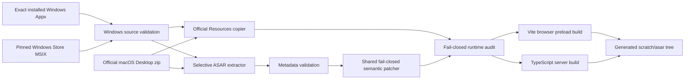

# Architecture

`codex-web` reuses the official Codex Desktop renderer while replacing the
Electron window boundary with a browser/server bridge. Official application
code is extracted at install time and is not stored in this repository.

## Build-time flow

Windows first selects the exact installed `OpenAI.Codex` Appx package recorded
in `scripts/runtime-versions.json` for the active Node.js architecture. If it is absent, the Windows adapter
downloads the pinned x64 or arm64 MSIX through the optional shared proxy and
extracts it atomically below ignored `scratch/` state. A historical release
mirror can transport the byte-identical Store payload, but it is not a trust
root: the adapter requires the Store Catalog byte length and SHA-256, a valid
Authenticode package signature whose signer is the pinned Appx publisher and
whose chain is issued by Microsoft, and the exact identity, publisher, version,
and architecture from `AppxManifest.xml`. Newer local Store packages are used
only by an explicit override and newer remote versions are never discovered.
Extraction decodes Appx block-map URI paths (for example `%40oai` to `@oai`)
before applying the archive traversal guard, matching Windows Store deployment
semantics for scoped Node packages.
macOS and Linux download the pinned official macOS zip, or consume
`HOSTED_CODEX_APP_ZIP` when supplied. Both paths converge on:

- `scripts/windows/setup.ps1` and `scripts/unix/*.sh`, the platform-specific
  source acquisition adapters behind the shared `npm run build` entry;
- `scripts/extract-needed-asar.mjs`, which extracts the Desktop package
  metadata, compiled shell bundles, webview, skills, native-menu locales, the
  private Work Louder device kit, and macOS `objc-js` support while preserving
  selected `app.asar.unpacked` entries;
- `scripts/copy-desktop-resources.mjs`, which copies the matching official
  `native/` and standalone `cua_node/` runtime on Windows and macOS;
- `scripts/audit-runtime-externals.mjs` and
  `scripts/runtime-externals.json`, which fail the build when a dynamic module,
  native resource literal, provider, native asset, or Computer Use runtime
  contract is added, removed, unresolved, or targets the wrong platform;
- `scripts/patch-desktop-asar.mjs`, which validates the ChatGPT brand and applies
  every browser compatibility change through unique semantic anchors;
- `scripts/generate-pwa-icon.mjs`, which creates the browser install icon; and
- the shared browser and server builds.

Selective extraction intentionally replaces upstream copies of
`better-sqlite3`, `node-pty`, `node-hid`, and SerialPort bindings with
project-owned host builds. This keeps database, terminal, HID, and serial
addons compatible with the Node runtime that hosts the browser bridge instead
of loading Electron-targeted binaries from an Appx or macOS bundle. The private
Work Louder JavaScript stays sourced from the official Desktop distribution;
the semantic patch makes host Node use `node-hid` discovery and the existing
polling fallback rather than the Electron-only HID topology watcher.

Windows and macOS retain the official `native/` tree as an audited Desktop
asset and copy the complete `cua_node/` standalone runtime. `cua_node` is
validated against its manifest, host architecture, executable paths, module
tree, and `@oai/sky` package. Native addons linked directly to Electron are not
treated as plain-Node providers: runtime paths continue to use upstream guards
and fallbacks. Linux has no official native Resources source, so its build
skips both trees explicitly; Codex Micro still uses host dependencies, while
native Computer Use remains unsupported there.

## Runtime flow

The official renderer expects a preload script and Electron IPC. Vite bundles
the upstream preload together with `src/browser/shim.ts`, which provides the
small Electron-compatible surface needed in a normal browser.

Renderer IPC is serialized over a WebSocket to `src/server/main.ts`. The server
loads the official Desktop main bundle after installing the module alias in
`src/server/module.ts`; imports of `electron` resolve to the host-side shim in
`src/server/electron/`. The existing MessagePort/app-host forwarding is kept so
subagents and newer Desktop protocol paths continue to work.

Every browser build emits a revision manifest and embeds the same revision in
its preload bundle. The server reads the manifest before listening and
announces the revision on each WebSocket connection. A long-lived renderer
reloads once when that value differs from its embedded revision, preventing a
server restart from reconnecting an old preload to newly deployed server code.
The entry HTML, preload bundle, and revision manifest are served with
`no-store`; content-hashed upstream assets retain normal static caching.

Electron `<webview>` guests are the one renderer contract that cannot execute
inside an ordinary browser. `src/browser/browser-webview.ts` retains the
renderer-owned Browser panel slot, paints frames into that slot, and forwards
explicit mouse, keyboard, and touch input. `src/server/electron/` reproduces the
native `will-attach-webview` / `did-attach-webview` lifecycle so the unmodified
Desktop Browser manager continues to own tabs, navigation, find, zoom, page
state, preload IPC, and Computer Use handles. The page itself runs in the
separate lazy `src/server/browser-host-electron.ts` process with sandboxing,
context isolation, and offscreen rendering. Each tab is a real
`WebContentsView`; all tabs share one transparent, non-focusable, never-shown
`BaseWindow` that only supplies compositor bounds. Electron 42 renders a fully
detached offscreen view at 0x0, so this single native backing surface is
required, but no tab owns a `BrowserWindow` or an independently revealable host
window. This avoids iframe CSP and `X-Frame-Options` failures and keeps
untrusted page code out of the plain-Node shell process. The sidecar accepts
only the exact pinned Electron version.
The painted surface uses inline-styled light DOM instead of a shadow root:
`webview` is not a valid autonomous custom-element name, so ordinary Edge and
WebKit may reject it as a shadow host even though Electron accepts it. Its
preload runtime is idempotent across duplicate evaluation. While the surface is
focused, an early capture listener owns keyboard events, forwards a native
key-down/character/key-up sequence to the guest, and prevents the renderer's
global composer shortcut from consuming the same text. Headless window methods
such as `showInactive()` retain their Electron focus semantics without trying
to reveal a second host window. The shared compositor host starts hidden,
transparent, frameless, off-display, non-focusable, and outside the taskbar; it
reasserts those invariants after sizing and before any unexpected show or focus
path can expose it. Renderer-side `RemoteWebContents` keeps logical focus,
while direct guest input injection deliberately never focuses the native
owner. Native DevTools are disabled because they would create another
host-owned window. The browser shim also maps renderer `open-in-browser`
requests to the renderer's native `toggle-browser-panel` message and consumes
the IPC locally, so a hosted URL cannot create a second browser window or fall
through to Desktop's external-browser handler.

`src/server/auth.ts` owns the optional shared-password boundary enabled by
`CODEX_WEB_AUTH_PASSWORD`. A Fastify request hook protects the renderer,
host-file route, uploads, and other HTTP handlers, while the raw server upgrade
handler independently validates the same random HttpOnly session before
accepting the IPC WebSocket. Login credentials are constant-time compared and
never enter renderer JavaScript. The server removes the password from its
environment before the Desktop shell can start Codex subprocesses. The
in-memory session intentionally becomes invalid when the server restarts. The
server-rendered login page negotiates English, Traditional Chinese, or
Simplified Chinese from `Accept-Language` and declares the selected content
language without loading client-side localization code.

The browser shim handles local browser concerns such as history mapping, mobile
sidebar state, touch interaction fallbacks, file/workspace selection, and local
file URLs. `src/browser/clipboard.ts` installs a native-first Clipboard API
facade for the upstream renderer. When an HTTP origin does not expose
`navigator.clipboard` or a write is rejected, text copies fall back to a
temporary selected textarea and `document.execCommand("copy")`; focus and the
original selection are restored afterward, while native read methods remain
bound to the browser clipboard object. `src/browser/mobile-layout.ts` treats
`navigator.maxTouchPoints` and
coarse-pointer media features as touch capabilities rather than relying on a
user-agent or orientation. Explicit context-action UI follows the active input:
iPads and phones begin in touch mode, while hybrid desktops switch on actual
touch/pen and mouse input. A captured `touchstart` remains authoritative when
iPadOS WebKit labels its compatibility pointer sequence as mouse. Input
capability does not select the page layout. Only phone-width viewports up to 700
CSS pixels use opaque overlay drawers. Those codex-web-owned drawers use
explicit renderer-matched light and dark fills instead of CSS system colors or
upstream surface tokens, whose transparent resolution differs between WebKit
and Chromium. Full-size iPads retain the renderer's persistent Desktop sidebars
in either orientation.
The renderer's application-menu/header layout remains intact, and the browser
layer owns outside-tap dismissal on phone layouts.
Outside-tap dismissal observes the real underlying target after a complete
click and does not consume its pointer sequence, so links and controls remain
first-tap operable while a drawer is open.
`src/browser/mobile-interactions.ts` owns a separate mobile interaction layer
instead of emulating Desktop gestures. Electron native menus cannot render in a
browser, so the semantic patcher makes codex-web use the shared renderer's
existing Radix context-menu branch while leaving Desktop on its native branch.
Sidebar thread actions open the renderer's exact context-menu root. While touch
is the active input, the row changes to a natural flex layout with explicit
content, status/loading, and action ownership. The stable status rail uses only
its real contents and disappears without reserving space when empty; the fixed
action slot follows it, so the controls cannot overlap or shorten the row
background.
Project and other renderer-owned menu controls are revealed in place. The file
tree enables its own built-in row menu button. On touch input, the right-panel
tab's existing trailing action lane exposes a dedicated options entry that
opens that tab's original context menu, including its close and panel-placement
actions. No browser-owned action portal, copied menu, or menu-style override is
used, so layout, focus, localization, callbacks, and animation remain owned by
the original renderer components. Left-sidebar and right-sidebar alternatives
share the single `data-codex-touch-input="true"` visibility contract; neither
side adds a separate viewport, layout, or capability condition.
Action controls listen only for completed clicks and permit native panning, so a
normal pointer sequence remains scrolling or the row's primary action.
Before an inline touch action opens a context menu, the shim asks the existing
Radix layer to dismiss any open menu with its native Escape path and waits one
animation frame before dispatching the new target's context event. Touch menu
switching therefore preserves native focus and exit animation without stacking
portals. Permanent touch actions occupy explicit natural-flow or renderer-owned
trailing slots so their hit targets cannot cover status, row, or tab content.
Workspace-file and diff menus can load their native open targets asynchronously.
The browser shim coordinates the renderer's controlled Radix roots so the menu
opens only after those original items resolve; a newer desktop right-click or
touch action supersedes any older pending request instead of showing an empty or
stale menu.

The shared semantic patch exposes the renderer-owned right-panel close action
and its open state to the browser shim. Mobile CSS keeps the animated panel
out of normal layout, clamps its persisted Desktop inner width to the drawer,
and disables the closed panel's pointer surface. Closing the drawer therefore
cannot leave Safari on a horizontally widened or offset document.
The shared semantic patcher removes Radix touch long-press menus, disables the
file tree's custom touch-drag activator, and makes dnd-kit's PointerSensor reject
every non-mouse pointer without consuming its event. HTML drag starts are also
cancelled while touch is the active input. Hardware mouse right click and mouse
drag remain Desktop-owned on hybrid devices.
Mobile search surfaces remain mounted when software-keyboard dismissal blurs
their input. Composer and other text-editing sessions also track the Visual
Viewport on touch devices while retaining the browser's native interactive
widget policy. The extracted Desktop renderer fixes `body` and `#root` to
`100vh`, which remains the obscured Layout Viewport height on mobile WebKit.
The browser shim does not resize or translate `body`, `#root`, or the complete
Desktop shell. It assigns each focused editable to a semantic owner and moves
only that renderer-owned region with the CSS individual `translate` property,
which composes with existing renderer transforms. The semantic patch gives the
prompt editor a static `composer` marker; it never changes `inputmode` or
rebuilds ProseMirror props during a pointer event. Mount-time composer autofocus
is declined on touch-capable browsers without changing direct tap, paste, or
hardware-keyboard focus. The prompt's unique
`[data-app-shell-main-content-layout]` ancestor is the center content region.
Only that center region follows the keyboard edge, leaving the application
header and both sidebars stationary. Ordinary center editors, dialogs, and
non-search sidebar editors move their own region only far enough to expose the
focused input. The composer project picker is marked separately from the cmdk
primitive shared with top search: when its search field opens the software
keyboard, the complete renderer-owned popover moves above the visible viewport
edge as one unit. Top command search and file-tree search keep native Visual
Viewport behavior; a visible text-file search receives a zero regional shift.

Visual Viewport changes are settle-debounced into a one-way transaction. The
shim does not alter geometry during WebKit's opening resize storm. Once the
viewport is stable, it reads the unshifted owner/input rectangle and applies at
most one correction for that focused owner; later viewport pan or accessory-bar
noise cannot rewrite it. A focus change commits the new owner only after its
geometry settles. Stable close removes the correction synchronously and relies
on the browser to restore its own Layout Viewport: the shim never calls
`scrollTo`, writes root scroll offsets, or runs an animation-frame sampler. If
iOS dismisses the keyboard without blurring, the focused owner remains armed
without a shift and can start a later transaction from the restored baseline.
The server shim owns privileged host behavior such as filesystem access and
launching the Codex app-server. Terminal creation remains in the official Desktop shell and
resolves the project-owned `node-pty` installation through Node's normal module
lookup. Platform-specific Appx/zip discovery never enters this runtime IPC
layer.

On every ordinary host, `scripts/managed-runtime.mjs` chooses the pinned Codex
CLI artifact by OS and architecture, validates its npm SRI SHA-512 value, and
extracts it below `scratch/runtime/`. `scripts/run-server.mjs` is both the npm
binary and server entry point; it prepares the runtime when missing and then
sets `CODEX_CLI_PATH` for the compiled server. It also owns the shared host,
port, and optional Tailscale discovery arguments on every platform. The Windows
build adapter uses the same runtime manager. Explicit `CODEX_CLI_PATH` values
remain overrides. No `CODEX_HOME` override is applied, so the managed executable
shares the host's normal account, configuration, and data directories.

`scripts/managed-download.mjs` owns the common proxy-aware, resumable download
transaction for pinned CLI and Windows Desktop archives. It publishes a cache
entry only after exact size and SRI validation. Artifact-specific trust remains
outside that transport layer: the CLI manager executes and checks `--version`,
while the Windows source adapter performs package signature and Appx metadata
checks before exposing a Resources tree.

Nix reads the same manifest artifacts but preserves reproducibility by fetching
the CLI into the Nix store and wrapping `codex-web` with that store path. Runtime
download caches and extracted binaries are never included in npm packages.

## Version contracts

These values must not be conflated:

- macOS Sparkle release version;
- Windows Appx package version;
- `version` inside the extracted ASAR;
- Electron version inside the ASAR package metadata; and
- Codex CLI version.

The ASAR version identifies renderer compatibility. Both browser and server
Electron shims read the extracted package metadata rather than relying on a
second hard-coded value. Windows prints every layer during setup. Default
versions and download integrity values are centralized in
`scripts/runtime-versions.json`; Nix reads the same Desktop and CLI versions.

## Patch policy

The former fingerprinted unified diffs were removed. Current Desktop releases
coalesce many modules into large fingerprinted chunks, making filename- and
format-sensitive diffs brittle across platforms. The shared semantic patcher:

1. locates a bundle using multiple independent behavior anchors;
2. requires exactly one match for each transformation;
3. recognizes an already-patched target; and
4. aborts on missing or ambiguous contracts.

The renderer's JavaScript TextMate engine is pinned to its ES2018 output target
at patch time. This prevents it from emitting ES2025 inline regular-expression
modifier groups that are not yet accepted by all Safari/WebKit versions while
preserving syntax highlighting on newer browsers.

Do not loosen an assertion merely to accept a new Desktop version. Inspect the
upstream behavior, update the anchor and transformation together, then exercise
the affected UI flow.

## Generated and packaged files

- `scratch/desktop-source/`: temporary Unix zip extraction.
- `scratch/desktop-packages/`: verified managed Windows MSIX extraction cache.
- `scratch/downloads/`: verified pinned CLI and Windows Desktop archives.
- `scratch/chatgpt-desktop.asar`: copied Windows source ASAR.
- `scratch/asar/`: patched package content shipped by npm/Nix.
- `src/server/**/*.js`: generated server output.

All are ignored by Git. The npm package includes only the patched extracted tree
and compiled server files, not the original Desktop archive.
